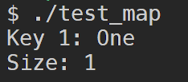

# HashMap Implementation

This repository contains the implementation of a custom hash map (similar to `std::unordered_map`), with support for various key types including `int`, `double`, `char`, `string`, and pointers. The hash map utilizes separate chaining for collision handling.

## Features

- **Customizable Hash Function**: You can use the default `std::hash` as implemented in the code or define your own custom hash function as per need.
- **Separate Chaining**: Implements separate chaining with linked lists to handle hash collisions.
- **Dynamic Resizing**: The hash map automatically resizes when the load factor exceeds a certain threshold (default 0.7).
- **Supports Various Data Types**: Supports `int`, `char`, `double`, `string`, and pointer types as keys.

## Classes and Files

### MapNode.hpp

This file defines the `MapNode` class, which represents each node in the linked list for the hash map. It stores a key-value pair and a pointer to the next node in the chain.

#### Key Features:
- Stores key-value pairs.
- Supports getter and setter methods for key, value, and next pointer.

### MyMap.hpp

This is the main file that implements the `MyMap` class. It defines the hash map structure and includes methods for insertion, deletion, resizing (rehashing), and value retrieval.

#### Key Features:
- **Constructor and Destructor**: Initializes the map with a set number of buckets (default 5) and handles memory cleanup.
- **Insert Method**: Adds key-value pairs to the map, resizing the map when necessary.
- **Remove Method**: Removes key-value pairs from the map.
- **Get Value**: Retrieves the value associated with a given key.
- **Load Factor**: Computes the load factor of the hash map, triggering rehashing if it exceeds a threshold.

### Compilation

To compile the program, ensure that the `MyMap.hpp` and `MapNode.hpp` files are in the same directory as your source file.

Use the following command :
```bash
g++ -std=c++17 tests/test_map.cpp -o test_map
./test_map
```

### Usage Example

```cpp
#include "MyMap.hpp"

int main() {
   MyMap<int, std::string> map;
    
   // Insert key-value pairs
   map.insert(1, "One");
   map.insert(2, "Two");
    
   // Retrieve value by key
   std::cout << "Key 1: " << map.getValue(1) << std::endl;
    
   // Remove key-value pair
   map.remove(1);
    
   // Get size
   std::cout << "Size: " << map.size() << std::endl;
    
   return 0;
}
```
   #### Output
   


